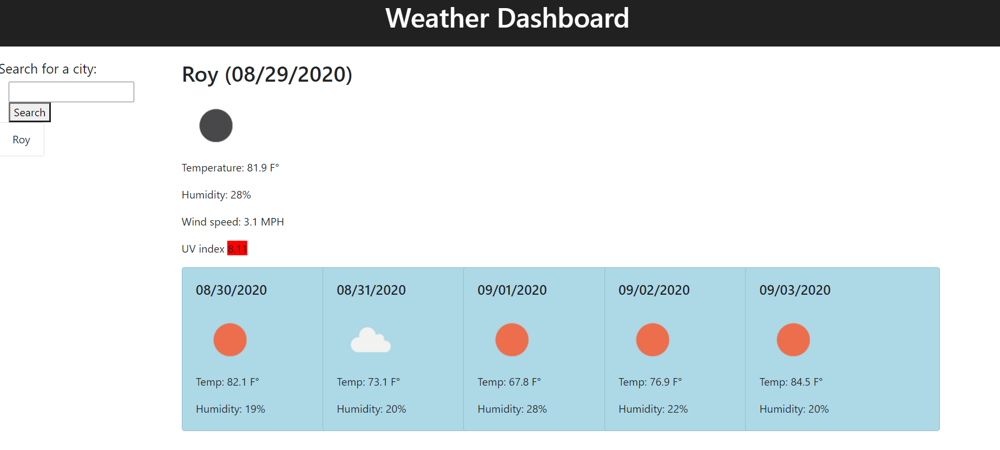

# weather-dashboard

## Description
This application allows the user to search for a city and see the weather forecast for that city. The forecast shows the temperature, humidity, UV index, and overall weather patterns for the current day. It also displays the current weather patterns, temperature, and UV index for the next five days. 

## Technologies
Technologies used:
- HTML
- CSS
- JavaScript
- reset.css by https://meyerweb.com/eric/tools/css/reset/
- Bootstrap 4
- Open weather API by https://openweathermap.org/api
- Moment.js by https://momentjs.com/

Access this application at https://abbynf.github.io/weather-dashboard/

## Contact
Please contact me at abbynfrandsen@gmail.com

## Credits
Thank you to jQuery, Bootstrap, openWeatherAPI, meyerweb.com, and moment.js